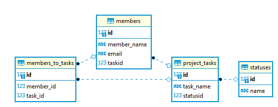
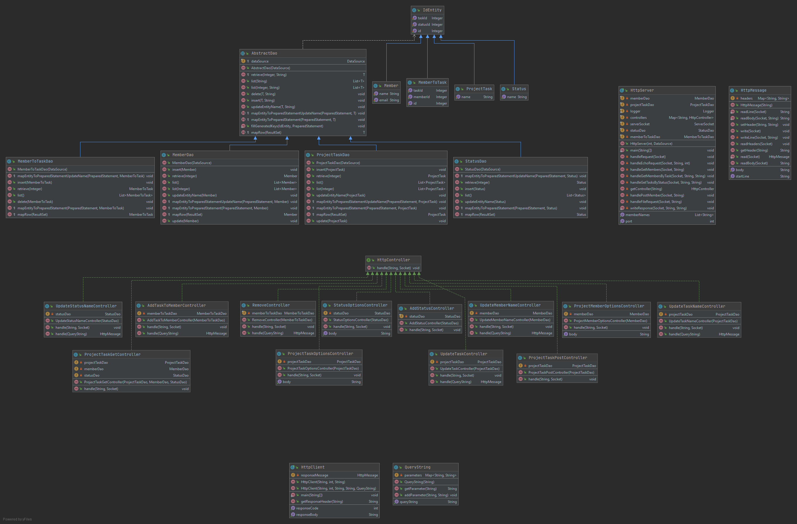

## Funksjonalitet, bygge og kjøre

### Funksjonalitet
Prosjektet er et prosjekt styringsverkøy for å holde styr på medlemmer, oppgaver og statuser. 
I tilleg til å opprette, kan koble dem til hverandre og filtrere (f.eks på statuser, for å se 
alle oppgaver innen den statusen)

### Bygge og kjøre
1) Kjør Maven > Lifecycle > clean for å fjerne /target. Kjør deretter package for å
bygge prosjektet og opprette .jar
2) Det må lages en konfigurasjonsfil som heter pgr203.properties, som må inneholder koden under
3) Kjør .jar med "java -jar target/pgr203eksamen-Hauugland-1.0-SNAPSHOT.jar" i terminalen. 
Dersom .jar kopieres over i annen mappe, skriver man "java -jar pgr203eksamen-Hauugland-1.0-SNAPSHOT.jar"

``` properties
    dataSource.url=...
    dataSource.username=...
    dataSource.password=...
```


## Datamodell og arkitektur

### ER-diagram (Datamodell)


### UML-diagram (Arkitektur)



## Ekstra leveranse utover minimumskravene
- [x] Håndtering av request target "/"
- [x] Avansert datamodell (mer enn 3 tabeller)
- [x] Avansert funksjonalitet (redigering av prosjektmedlemmer, statuskategorier, prosjekter)
- [ ] Implementasjon av cookies for å konstruere sesjoner
- [x] UML diagram som dokumenterer datamodell og/eller arkitektur (presentert i README.md)
- [x] Rammeverk rundt Http-håndtering (en god HttpMessage class med HttpRequest og HttpResponse subtyper) som gjenspeiler RFC7230
- [x] God bruk av DAO-pattern
- [x] God bruk av Controller-pattern
- [x] Korrekt håndtering av norske tegn i HTTP
- [x] Link til video med god demonstrasjon av ping-pong programmering
- [x] Automatisk rapportering av testdekning i Github Actions
- [ ] Implementasjon av Chunked Transfer Encoding
- [x] Annet (Kan legge til flere oppgaver per medlem, man kan filtrere på status og oppgaver, man kan 
fjerne enkeltoppgaver fra medlemmer, man kan endre status på oppgaver, bruk av "stream().map" og ".collect(Collectors.joining())
ved printing av options i select bokser, plussmer)

## Egenevaluering

### Erfaringene med arbeidet og løsningen

Vi startet faget med å splitte kohorten i 2 og 2. 
Vi tenkte det var bedre å jobbe med mindre grupper gjennom arbeidskravene. 
Etter siste arbeidskrav syntes vi det begynte å bli vanskeligere og tenkte at det er best med alle på kohorten sammen. 
Vi slo derfor sammen hele kohorten igjen for å fullføre eksamen sammen. 
Måten vi gjorde det på var at en programmerte mens alle så på Discord og kunne komme med innspill. 
Det fungerte godt for gruppen og samles på discord for så og jobbe virituelt på en maskin. 
Dette gjorde at vi raskere kom fram til løsninger, og på den måten jobbet mer effektivt en om vi satt med hver vår oppgave til enhver tid. 
Det var for oss bedre at 4 hoder tenkte på det samme problemet en at man sitter med det helt alene og da fortsatt måtte ha spurt de andre i gruppen om hjelp. 
Vi ble som sagt veldig fornøyd med et endelige resultatet, vi fikk programmet til å kjøre mye med hjemmesnekkret kode, og det var morro å finne egne løsninger på vanskelige problemer.   

### Hva har vi lært

Før vi begynte undervisning i dette faget, kunne java til tider virke litt "skremmende". 
Vi ble raskt kastet på dypt vann, men det var hele tiden en reddningsbøyle i nærheten for å forhindre at vi "druknet". 
Etter dette semesteret er det fortsatt en smule fryktinngytende, men vi føler at vi nå kan bedre manipulere java-kode slik vi vil. 
En morsom teknikk vi har lært under fagets løp er parprogrammering. 
Dette har vi benyttet oss av i stor grad under hele perioden, da det ga oss gode resultater og raskere. 
Vi har lært mye om hvor viktig det er å kode, feile, feilsøke og der av finne løsningen. 
Man må ikke alltid ha svaret i hodet, men heller prøve seg fram.
Vi sitter igjen med en god forståelse av Maven og har ikke hatt kronisk vondt i "maven", kun til tider. 
Vi fått god kunnskap med testdekkning av programmet, vi har forstått verdien av og kjøre tester parallelt med kodingen for å verifisere koden.   

## Video av parprogrammering
https://youtu.be/ejZMhAd5BwY